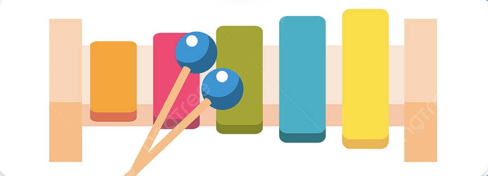

# Xylophone
##What we created

 We made our first musical instrument! Music apps are so popular on the App Store that they even get their own category.

##What we learned

* How to play sound using AVFoundation and AVAudioPlayer.
* Functions and methods in Swift.
* Data types.
* Swift loops.
* Variable scope.
* The ViewController lifecycle.
* Error handling in Swift.
* Code refactoring.
